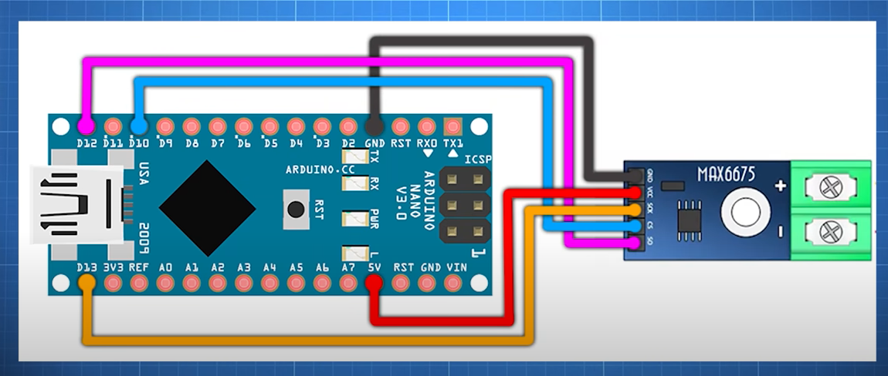

# Налаштування

## Устаткування

1. Arduino
2.[Термопара К-типу з цифровим підсилювачем на MAX6675](https://arduino.ua/prod1785-termopara-k-tipa-s-cifrovim-ysilitelem-na-max6675)

## Software

1. [Arduino IDE 2](https://www.arduino.cc/en/donate/)
2. Драйвера [CH340](https://arduinokit.com.ua/ua/a462945-ustanovka-drajvera-ch340.html) для плат Arduino Uno, Nano, Mega 2560
   - Без цього драйверу `COM3` порт для Arduino Uno для китайських плат не визначався. В диспечері пристроїв був невпізнаний пристрій `USB Serial`.
3. Бібліотека для роботи з термопарою [MAX6675](https://github.com/GyverLibs/GyverMAX6675)

Приклад коду для зчитування даних (з посилання)
```cpp
#include <GyverMAX6675.h>

// Піни модуля MAX6675K
#define CLK_PIN   13  // Пін SCK
#define DATA_PIN  12  // Пін SO
#define CS_PIN    10  // Пін CS

// вказуємо піни в порядку SCK SO CS
GyverMAX6675<CLK_PIN, DATA_PIN, CS_PIN> sens;

void setup() {
  Serial.begin(9600);
}

void loop() {
  if (sens.readTemp()) {            // Читаємо температуру
    Serial.print("Temp: ");         // Якщо читання пройшло успішно - виводимо в Serial
    Serial.print(sens.getTemp());   // Забираем температуру через getTemp
    //Serial.print(sens.getTempInt());   //  або getTempInt - цілі числа (без float)
    Serial.println(" *C");
  } else Serial.println("Error");   // помилка читання або підключення - виводимо лог

  delay(1000);                      // Затримка виведення
}
```

## Розпіновка

Розпіновка також відповідає моделі Arduino Uno.



## Запис даних в файл

Для запису в файл краще використовувати [PuTTY](https://mechatrofice.com/arduino/save-serial-data-to-a-text-file-arduino-processing-putty). 

Треба витбрати порт `COM3` та увімкнути логування. Виведення порту буде в `.log`-файлі.
