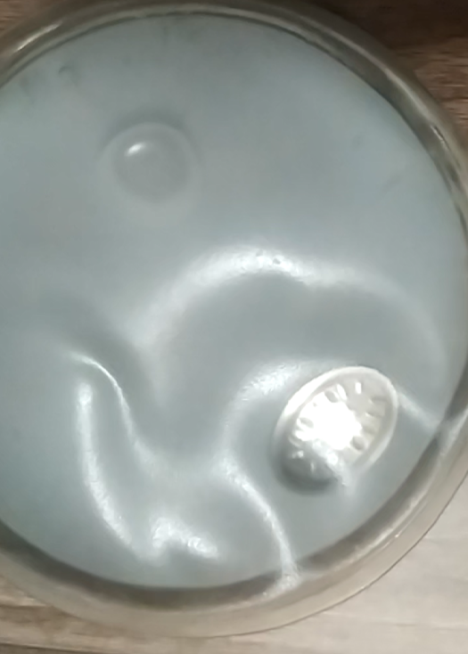

# Сольова грілка

## Принцип дії

Грілка являє собою ємність із перенасиченим сольовим розчином, найчастіше як такий використовують перенасичений розчин [ацетату натрію](https://uk.wikipedia.org/wiki/%D0%9D%D0%B0%D1%82%D1%80%D1%96%D0%B9_%D0%B0%D1%86%D0%B5%D1%82%D0%B0%D1%82). Розчин перебуває в стані рівноваги. Усередині розчину плаває "пускач" або аплікатор. При перегинанні аплікатора розчин виходить зі стану рівноваги, зігнутий аплікатор стає центром кристалізації, спричиняючи фазовий перехід розчину з рідкого стану в твердий. Перехід супроводжується виділенням тепла, і грілка розігрівається до температури близько 50-54 °С. Час роботи становить 3-4 години залежно від її розмірів і зовнішньої температури.

Процес відновлення зворотний: грілку загортають у тканину і поміщають на 5-20 хвилин у киплячу воду. Розчинення кристалів солі відбувається з поглинанням тепла, після чого грілка знову готова до повторного використання.

## Відеодемонстрація роботи грілки

